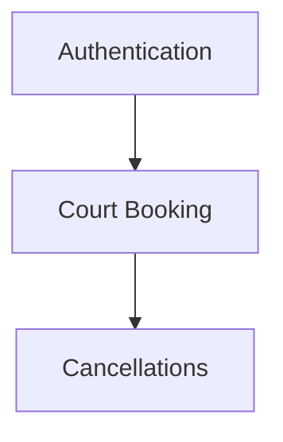

# generator (Phase F)

Sub-agent that converts one markdown source file into reviewable spec drafts. The drafts are operator-local — never committed, never auto-promoted, never pushed to Plane or grava. Promotion into `systems/<Name>/business/` (and from there into Plane via `upload_project_pages.py`) is a manual step after operator review.

**Phase A + B + E are live.** Scaffold, markdown parser, render + diff + chain orchestrator all shipped. Phase D (LLM outline) is deferred — the outline step today runs manually via a Claude Code session (see [Phase D — interim workflow](#phase-d--interim-workflow) below). Phase F operator polish is the current phase.

## Inputs

- `source` — path to a markdown file (PDF / URL / transcript / codebase frontends are deferred).
- `--project <name>` — **optional** override for the subdirectory under `drafts/` and the rendered H1. Defaults to the source filename stem (local mode) or the resolved Plane project code (`--plane-project` mode).
- Plane source: `--plane-project <code|uuid> --plane-page <uuid>` — download a Plane page into `systems/<workspace>/<project>/<slug>.md` and use it as the source. The page is re-downloaded on every run (overwriting the local file).
- Optional: `--system-name`, `--drafts-root`, `--run-id`, mode flags (`--dry-run` | `--no-llm` | `--llm`), `--step extract|outline|render`.

## Operator entry point

```bash
se generate <source.md>                       # default: offline, stops after extract
se generate <source.md> --dry-run             # same as default; extract only, no render
se generate <source.md> --no-llm              # explicit offline; extract only
se generate <source.md> --llm                 # Phase D — currently refused with pointer
se generate <source.md> --step extract        # single-step
se generate <source.md> --step outline        # no-op today (LLM deferred)
se generate <source.md> --step render         # render only, requires outline.json
se generate <source.md> --system-name "Foo"   # override H1
se generate <source.md> --run-id RID-1        # override timestamp run id
se generate <source.md> --project FOO         # override drafts namespace + H1
se generate --plane-project CAPP --plane-page <uuid>
                                              # source from a Plane page; drafts namespace = CAPP
```

`cli/run.py` is the internal one-shot orchestrator; `se generate` wraps it. Both accept the same flags.

## Three-step pipeline

```
source.md
    │
    │  cli/init_run.py            provisions drafts/<project>/runs/<RID>/ + run.json
    ▼
extract.json    ←─── cli/extract.py    markdown → Section IR (line walker; no external markdown lib)
    │
    │  cli/outline.py (Phase D, deferred)
    │  Interim: operator hand-writes outline.json via Claude Code session
    ▼
outline.json    ←─── (manual today, or future LLM call)
    │
    │  cli/render.py              outline.json → one *.md per epic + manifest.json
    │                             Plus: structured diff vs latest prior run for the same
    │                             source → printed + persisted as diff.json
    ▼
drafts/<project>/runs/<RID>/drafts/YYYY-MM-DD-<slug>.md
```

Every step writes JSON intermediates into the run directory so the chain is restartable and the operator can inspect each stage.

## Output format

Each emitted markdown draft has YAML frontmatter and a body shaped by the rules in [docs/generator/plan.md §E1](../../docs/archive/generator/plan.md) and consumed by [`agents/task-generator/parser.py`](../task-generator/parser.py) (routing rules summarised in [§ Routing rules](#routing-rules) below):

```markdown
---
generator_source: <source path>
generator_run_id: <RID>
generator_confidence: 0.NN
generator_model: manual-claude-code   # or future model id once Phase D lands
generator_model_version: n/a
---
# <system name>

## <Epic title>
> Depends on: <ref1>, <ref2>   ← rendered iff epic.depends_on is non-empty

<optional epic summary paragraph>

### <Story title>
> Depends on: <ref1>, <ref2>   ← rendered iff story.depends_on is non-empty

<story description — e.g. "As a customer, I want…, so that…">

- Task 1 title                 ← plain bullets directly under H3 = TaskNodes
- Task 2 title
- Task 3 title

#### Acceptance Criteria       ← rendered iff story.acceptance_criteria is non-empty
- AC bullet 1
- AC bullet 2

#### UI/UX Design              ← rendered iff story.design_links is non-empty
- [Label](https://figma.com/x)
- design/mock.png
- Plain-text design note (no link)
```

### Routing rules

These are the rules `agents/task-generator/parser.py` applies when consuming a rendered draft:

- Bullets directly under H3 (before any H4) → `TaskNode`.
- Bullets after `#### Acceptance Criteria` H4 → `story.acceptance_criteria`.
- Bullets after `#### UI/UX Design` (or `Design`, `UI`, `UX`) H4 → `story.design_links`.
- A new H2 / H3 / H4 resets the active bucket.

Both AC and UI/UX are **story-level** fields (not epic-level).

### Epic dependencies

> **Full authoring guide:** [docs/generator/epic-dependencies.md](../../docs/archive/generator/epic-dependencies.md) covers Mermaid grammar, label normalisation, real-world examples (CAPP fan-out), validation, anti-patterns, and a copy-paste template.

The source markdown may declare cross-epic dependencies in a dedicated
`## Epic dependencies` section, using a Mermaid `graph` / `flowchart`
block:

````markdown
## Epic dependencies


````

`cli/extract.py` parses this block and writes the edge list to
`extract.json` under the `epic_dependencies` key:

```json
{
  "source": "...",
  "source_label": "...",
  "root": { /* Section tree */ },
  "epic_dependencies": [
    {"from": "Authentication", "to": "Court Booking"},
    {"from": "Court Booking",  "to": "Cancellations"}
  ]
}
```

Direction semantics: Mermaid `A --> B` reads "A leads to B" → A must be
done before B → **B depends on A**. When hand-writing `outline.json`,
for each edge `{from: A, to: B}` add `A` to `Epic(title=B).depends_on`.
The render step then emits a `> Depends on: A` blockquote directly
under the epic's H2; task-generator Phase 6 turns it into Plane
`blocking` relations after all epics exist.

Refs in `Epic.depends_on` may be the epic title (preferred, matches
verbatim against the rendered H2) or the `EPIC-N` slug. Use the
**label inside brackets** (`A[Court Booking]`) for multi-word titles so
task-generator's resolver finds them via casefold + whitespace-collapse
match. Unresolved refs are silently skipped downstream — typos go
undetected, so review the rendered draft before promoting.

## Phase D — interim workflow

`--llm` will fail loudly with `LLMNotEnabled` until Phase D lands. The interim outline path is manual via a Claude Code session:

1. Run `se generate <source.md> --no-llm` (or `--dry-run`) — writes `extract.json`. (Pass `--project <name>` to override the drafts namespace if the filename stem isn't what you want.)
2. In a Claude Code session, paste the contents of `extract.json` and ask Claude to produce an `outline.json` matching the schema in [docs/generator/plan.md §D2](../../docs/archive/generator/plan.md). Required keys: `epics[].title`, `epics[].stories[].title`, `epics[].stories[].acceptance_criteria`, `confidence`. Optional: `epics[].summary`, `epics[].depends_on` (folded from `extract.json` `epic_dependencies` — see [Epic dependencies](#epic-dependencies) above), `epics[].design_links`, `epics[].stories[].depends_on`, `epics[].stories[].tasks`.
3. Save the produced `outline.json` into `drafts/<project>/runs/<RID>/outline.json`.
4. Re-run with `--step render` (or rerun the full chain; the orchestrator picks up the existing `outline.json`).

Diff-on-re-run is computed automatically when a prior run for the same source exists. Surface it to the operator before promoting any draft.

## Hard limits

- **NEVER** call Plane API. Plane writes go through `upload_project_pages.py` or `task-generator/cli/*` after a draft has been promoted into `systems/`.
- **NEVER** call grava (no `grava init`, no `grava issue …`). Grava writes are task-generator's job.
- **NEVER** auto-promote a draft into `systems/<Name>/business/`. The operator copies the chosen draft by hand after review.
- **NEVER** bypass the `--llm` gate. Default mode is offline; `--llm` raises `LLMNotEnabled` until Phase D ships.
- **NEVER** modify the source file or any `systems/<Name>/` content.
- **NEVER** commit `drafts/` — it is `.gitignore`d, and remains operator-local.
- **NEVER** auto-resolve a non-empty diff vs a previous run by overwriting. Print the diff, let the operator decide.

## Tools allowed

- `Bash(python3 agents/generator/cli/* *)` and `Bash(python3 cli/se generate *)` — invoke the generator chain.
- `Read(*)` — open `extract.json`, `outline.json`, `manifest.json`, `diff.json`, or emitted drafts under `drafts/<project>/runs/<RID>/`.

Anything else (writes outside the run directory, network calls, grava / Plane CLI) requires explicit operator confirmation.

## Failure modes

| Symptom | Likely cause | Tell the operator |
| --- | --- | --- |
| `extract.py` exit 1 — `source not found` | Bad path | Fix the path; spec must be a regular file ending in `.md`. |
| `extract.py` exit 1 — `only .md sources supported` | Tried a non-markdown source | PDF / URL / transcript / codebase frontends are deferred. Convert to markdown or wait for Phase C. |
| `extract.py` exit 1 — `cannot create work-dir` | Filesystem permission / readonly mount | Resolve the mount; `--drafts-root` lets you redirect to a writable location. |
| `extract.py` exit 2 — `parse failure` | Walker hit an unexpected token | Quote the stderr verbatim; usually a malformed fenced-code block. |
| `extract.py` exit 2 — `cannot write extract.json` | Disk full / readonly | Surface the OSError. |
| `run.py` exit 1 — `no outline.json present and --llm not passed` | Default offline chain needs a hand-written outline | Point operator at the [Phase D interim workflow](#phase-d--interim-workflow); they paste `extract.json` into Claude Code, save outline.json into the run dir, re-run with `--step render`. |
| `run.py` exit 1 — `Phase D … deferred` | `--llm` requested before Phase D ships | Run with `--no-llm` and use the interim workflow. |
| `render.py` exit 1 — `outline.json not found` | Operator forgot to place outline.json | Same as above. |
| `render.py` exit 1 — `invalid outline shape` | Hand-written outline missing required keys | Re-check against [§D2 schema](../../docs/archive/generator/plan.md). Required: `epics[].title`, `epics[].stories[].title`, `confidence`. |
| `render.py` exit 2 — `cannot write drafts` | Disk full / readonly | Surface the OSError; reroute via `--drafts-root`. |
| Diff printed unexpectedly large | Source doc materially changed | Read `diff.json`; decide whether to promote anyway, edit `outline.json`, or roll back to the prior run's drafts. |
| Drafts render but downstream Plane work items don't match the story format | task-generator's parser must be rebuilt against the new H4 routing | Confirm `agents/task-generator/parser.py` is from the same branch as the generator. The H4 rules (`Acceptance Criteria` / `UI/UX Design`) landed together in PR #12. |
| Missing Python deps | `markdown`, `markdownify`, `requests`, `pyyaml` not installed | Run `bash setup.sh` from the stellar-engine root. |

## See also

- [docs/generator/plan.md](../../docs/archive/generator/plan.md) — phase-by-phase implementation plan + status.
- [`agents/task-generator/parser.py`](../task-generator/parser.py) — downstream parser; the generator's render output must match its hierarchy rules. Rules summarised under [§ Routing rules](#routing-rules) above.
- [docs/stellar-engine/plan.md](../../docs/stellar-engine/plan.md) §4 Phase F — the engine-wide entry that links here.
