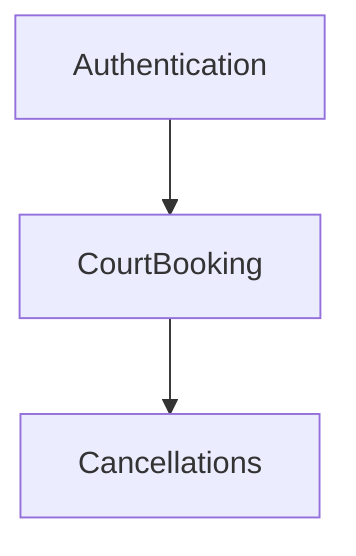
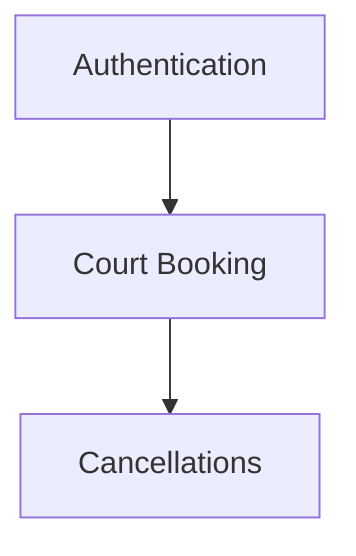
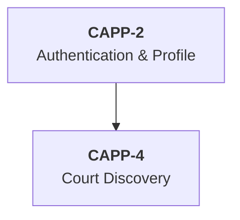
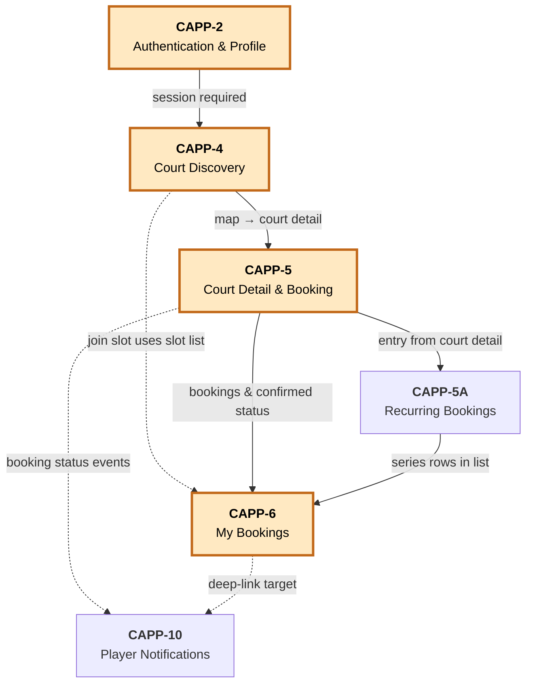
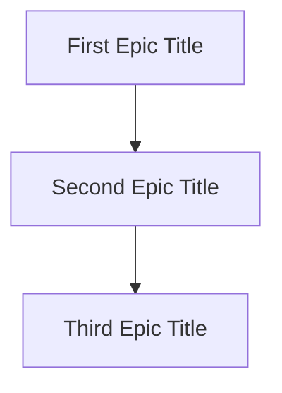

# Authoring epic dependencies with Mermaid

This guide walks through declaring **epic-to-epic dependencies** in a source markdown so that `se generate` extracts them automatically and `se taskgen` writes Plane `blocking` relations after the epics exist. End-to-end:

```
source.md (## Epic dependencies + mermaid)
  → extract.json   epic_dependencies: [{from, to}, ...]
  → outline.json   Epic.depends_on
  → drafts/*.md    `> Depends on: …` blockquote under each H2
  → Plane epics + `blocking` relations + grava mirror
```

If you only need the TL;DR, skip to the [Cheat sheet](#cheat-sheet).

---

## 1. Where the graph lives

Add a single H2 section at the **bottom of the source spec**, after every epic:

````markdown
## Epic dependencies


````

Rules:

- The H2 heading text must be `Epic dependencies` (case-insensitive, whitespace-tolerant; `## EPIC DEPENDENCIES` / `## Epic Dependencies` are both fine).
- The fenced code block must be tagged `mermaid` *or* its first non-blank line must start with `graph ` / `flowchart `.
- Only the first matching mermaid block under the section is parsed. Put the graph there; explanatory prose can sit above or below it.
- The section is **optional** — specs without epic-level deps render exactly as before.

---

## 2. Direction semantics

Mermaid `A --> B` reads "A leads to B". In project-management terms this means **A must ship before B** — i.e. **B depends on A**.

| You write | Plain English | Outline result |
|-----------|---------------|----------------|
| `Authentication --> CourtBooking` | Authentication blocks Court Booking | `Epic(title="CourtBooking").depends_on = ["Authentication"]` |
| `CourtBooking --> Cancellations` | Court Booking blocks Cancellations | `Epic(title="Cancellations").depends_on = ["CourtBooking"]` |

The arrow always points from **prerequisite → dependent**. Read it as "after A, do B".

> **Don't think in terms of "blocks"** when authoring. Just draw the dependency arrows in the order work has to happen. The fold step inverts the direction into `depends_on` automatically.

---

## 3. Supported syntax

The generator implements a deliberately small subset of Mermaid — enough for dep graphs, nothing more.

### 3.1 Headers

```mermaid
graph TD
graph LR
graph BT
graph RL
graph TB
flowchart TD
flowchart LR
```

Direction (`TD` / `LR` / `BT` / `RL` / `TB`) is accepted but **ignored** by the parser — edges are always read in arrow direction, not layout direction. Use whichever direction reads best visually.

### 3.2 Node forms

| Form | Notes |
|------|-------|
| `Authentication` | Bare ID. The ID *is* the resolved label. Works for single-word epic titles. |
| `A[Court Booking]` | Square-bracket label. Multi-word friendly. Bracket label wins; the bare `A` ID is only a Mermaid handle, never appears in extract.json. |
| `A(Court Booking)` | Round-bracket label. Same semantics. |
| `A{Court Booking}` | Curly-brace label. Same semantics. |
| `A["Court Booking"]` | Double-quoted label. Quotes stripped. Use when label contains `]` or other shape-breaking chars. |

**Best practice: declare each node up top, draw edges below.**



This is the **only** way to get readable label resolution when an edge refs the same node twice. Once `AUTH[Authentication]` is declared, every later `AUTH` resolves to `"Authentication"` automatically.

### 3.3 HTML inside labels

Mermaid renders HTML inside `["..."]`. Common patterns:



The parser normalizes this:

| Input fragment | Becomes |
|----------------|---------|
| `<br/>`, `<br>`, `<br />` (case-insensitive) | a single space |
| `<b>`, `</b>`, `<i>`, any other tag | stripped entirely |
| Surrounding quotes + whitespace | trimmed |
| Internal multiple spaces | collapsed |

So `<b>CAPP-2</b><br/>Authentication & Profile` → `CAPP-2 Authentication & Profile`. That's the string that lands in `extract.json`.

### 3.4 Arrow variants

All of these are recognised:

```mermaid
A --> B
A-->B
A -.-> B
A ==> B
A --> |edge label| B
A -.-> |notes here| B
```

The arrow **style** (solid / dotted / thick) and any `|edge label|` text are dropped — only the direction matters. So in the CAPP graph below, `CAPP4 -.->|CAPP-054 join slot uses slot list| CAPP6` becomes a plain edge from CAPP4 to CAPP6.

### 3.5 What's silently skipped

These lines are parsed and ignored — no errors, no warnings:

- `%% comment lines` (Mermaid comments)
- Undirected edges: `A --- B` (no direction → no dep)
- Mermaid styling: `classDef foo fill:#fff,stroke:#000,...`
- Mermaid class assignment: `class A,B foo`
- `style A fill:#fff,...`
- Subgraphs, `click`, `linkStyle` — out of scope for v1

You can paste a richly styled Mermaid graph straight from a design doc; only the edges + node labels are extracted.

---

## 4. Naming refs

The label string that ends up in `extract.json.epic_dependencies[].from` (and later in `Epic.depends_on`) is what task-generator uses to wire Plane `blocking` relations. Task-gen resolves a ref by trying, in order:

1. **`EPIC-N` slug** — matches `^EPIC[-_ ]?(\d+)$`. Use this if your epics happen to follow that naming convention.
2. **Plane-style identifier** — e.g. `CAPP-2`, matched against the epic's `related_refs` field.
3. **Title match** — casefold + whitespace-collapse against the epic's title.

Three practical rules:

1. **Use bracket labels for multi-word epics.** `A[Court Booking]` is a title match; `CourtBooking` (no space) won't match an epic titled `Court Booking`.
2. **Match the rendered H2 verbatim.** Whatever you write in `Epic(title="...").depends_on` must be findable from a rendered draft's `## ...` line. If you author labels as titles, this is automatic.
3. **Don't mix slug and title in one graph.** Pick one convention. Mixing works but makes diffs harder to read.

---

## 5. Folding `extract.json` → `outline.json`

Today's outline step is **manual** (Phase D LLM call is deferred). After `se generate <source.md> --project <name>` finishes the extract step, the run directory looks like:

```
drafts/<name>/runs/<RID>/
├── run.json
└── extract.json          ← has top-level `epic_dependencies` if mermaid present
```

`extract.json` will carry:

```json
{
  "source": "...",
  "source_label": "...",
  "root": { /* Section tree */ },
  "epic_dependencies": [
    {"from": "Authentication", "to": "Court Booking"},
    {"from": "Court Booking",  "to": "Cancellations"}
  ]
}
```

For each edge `{from: A, to: B}`, add `A` to `Epic(title=B).depends_on` when hand-writing `outline.json`:

```json
{
  "epics": [
    {"title": "Authentication", "depends_on": []},
    {"title": "Court Booking",  "depends_on": ["Authentication"]},
    {"title": "Cancellations",  "depends_on": ["Court Booking"]}
  ],
  "confidence": 0.9
}
```

Then run `se generate <source.md> --project <name> --step render` to emit the markdown drafts. Each draft carries a `> Depends on: …` blockquote under its H2:

```markdown
## Cancellations
> Depends on: Court Booking

Refund window + audit log.

### US-C1 — Cancel a booking
...
```

That blockquote is exactly the contract `agents/task-generator/dependency_analyzer.py` parses to build the `blocking` graph it posts to Plane.

---

## 6. Worked examples

### 6.1 Minimal chain

```markdown
# Sport Buddies

## Authentication
Login + signup.

## Court Booking
Pick + reserve a court.

## Cancellations
Refund + audit.

## Epic dependencies


```

Extracts 2 edges. Each epic's `depends_on` after folding:

```
Authentication.depends_on = []
CourtBooking.depends_on   = ["Authentication"]
Cancellations.depends_on  = ["CourtBooking"]
```

### 6.2 Fan-out + fan-in (real CAPP spec)

```markdown
## Epic dependencies


```

Extracts 8 edges:

```
CAPP-2 Authentication & Profile  →  CAPP-4 Court Discovery
CAPP-4 Court Discovery           →  CAPP-5 Court Detail & Booking
CAPP-4 Court Discovery           →  CAPP-6 My Bookings
CAPP-5 Court Detail & Booking    →  CAPP-5A Recurring Bookings
CAPP-5 Court Detail & Booking    →  CAPP-6 My Bookings
CAPP-5A Recurring Bookings       →  CAPP-6 My Bookings
CAPP-5 Court Detail & Booking    →  CAPP-10 Player Notifications
CAPP-6 My Bookings               →  CAPP-10 Player Notifications
```

Edge labels and `classDef` / `class` lines silently dropped. Note `CAPP-6 My Bookings` has **three** parents — fan-in is fine, task-gen records all three `blocking` relations.

---

## 7. Validation + error handling

### What's validated

| Check | Where | Outcome |
|-------|-------|---------|
| Mermaid block recognised | generator extract | Block parsed → `epic_dependencies` written |
| Section present but unparseable (e.g. prose only) | generator extract | `epic_dependencies` key omitted from extract.json |
| Edge ref resolves to an epic | task-gen Phase 6 | Plane `blocking` relation created |
| Edge ref doesn't resolve | task-gen Phase 6 | `ParseWarning(kind="unresolved_dep_ref")`, edge silently skipped |
| Cycle in graph | task-gen Phase 6 | `ParseWarning(kind="dep_cycle")`, topological reorder skipped |
| Self-loop (`A --> A`) | task-gen Phase 6 | `ParseWarning(kind="self_dep")`, edge dropped |

### What's NOT validated

The generator parser is permissive — typos go undetected at the source layer. **You only catch unresolved refs at the task-gen step.** Review the dry-run output before committing:

```bash
se taskgen <project> <page> --dry-run
# Look for: `deps: edges=N unresolved=0 cycles=0 reordered=yes`
```

If `unresolved > 0`, open the master-preview file the dry-run emitted and check the **Dependencies** section for unresolved ref lines.

### Strict mode

`se taskgen --strict-deps` fails (exit 5) instead of warning when any ref can't be resolved. Worth turning on for production specs once you've stabilised the graph.

---

## 8. Anti-patterns

| Anti-pattern | Why it hurts | Fix |
|--------------|--------------|-----|
| Edge label contains the actual dep info you wanted to extract | Edge labels are dropped. Only direction matters. | Move the info into a body paragraph under the epic, or use a comment `%%`. |
| Multi-word bare ID: `Court Booking --> Cancellations` | Mermaid tokenises on whitespace; this is a syntax error. | Use a bracket label: `Booking[Court Booking] --> Cancel[Cancellations]`. |
| Declaring labels twice with different text: `A[Auth] ... A[Authentication]` | The second declaration overwrites the first; downstream resolution may flip mid-graph. | Pick one canonical label per node. |
| Using `---` (undirected) when you meant `-->` | Undirected edges are silently dropped — your dep disappears. | Use a directional arrow. |
| Cycles introduced for "soft" relationships | Task-gen detects + warns, then drops topological reorder. | Use a separate `## Related epics` prose section for soft links; the dep graph is for hard ordering only. |
| Putting the mermaid block in a `## Dependencies` section (no "Epic" prefix) | Extract only looks under `## Epic dependencies`. | Rename the section. |

---

## 9. Cheat sheet

Paste this template into a new spec:

````markdown
## Epic dependencies


````

Then:

```bash
se generate spec.md --project DEMO
jq .epic_dependencies drafts/DEMO/runs/*/extract.json   # sanity check
# Hand-edit outline.json, populate each Epic.depends_on from the edges
se generate spec.md --project DEMO --step render
grep -A1 "^## " drafts/DEMO/runs/*/drafts/*.md          # confirm `> Depends on:` lines
se taskgen <project-uuid> <page-uuid> --dry-run         # confirm `unresolved=0`
se taskgen <project-uuid> <page-uuid> --yes             # write Plane + grava
```

---

## 10. See also

- [`docs/generator/usage.md`](usage.md) §2 — full outline-step walkthrough (this is the surrounding workflow).
- [`docs/generator/plan.md`](plan.md) §D2 — outline.json schema, including `epics[].depends_on`.
- [`agents/generator/AGENT.md`](../../agents/generator/AGENT.md) — generator sub-agent contract; mentions the mermaid hook.
- [`agents/generator/mermaid.py`](../../agents/generator/mermaid.py) — the parser. Read it if you hit an edge case not covered above.
- [`agents/task-generator/dependency_analyzer.py`](../../agents/task-generator/dependency_analyzer.py) — the downstream resolver. Owns the ref-to-epic matching rules in §4.
